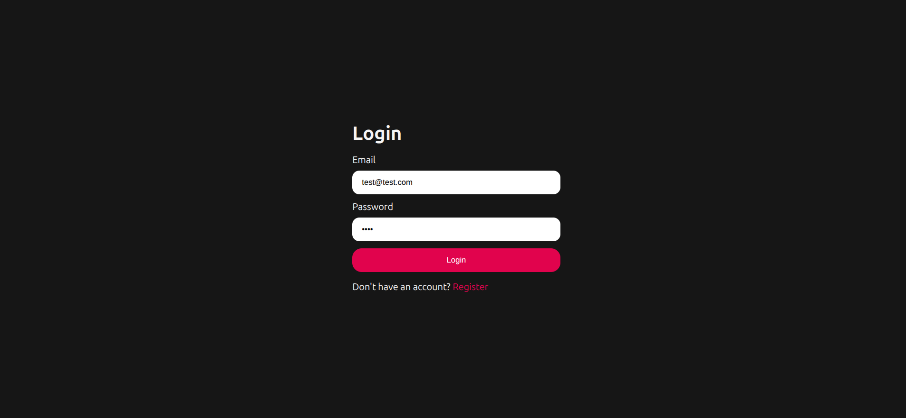
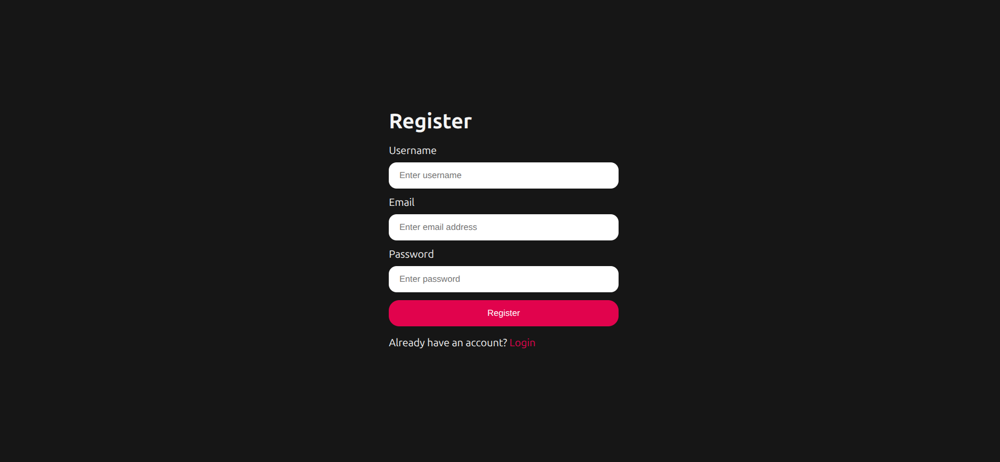
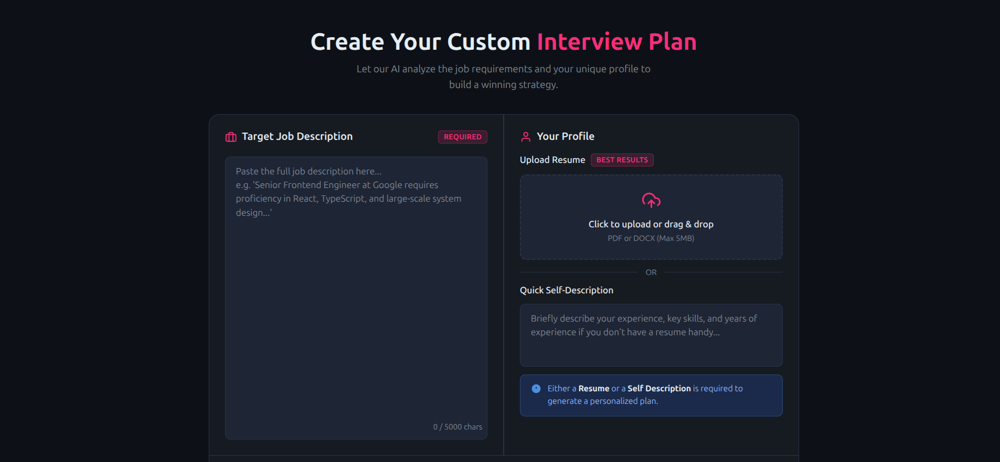
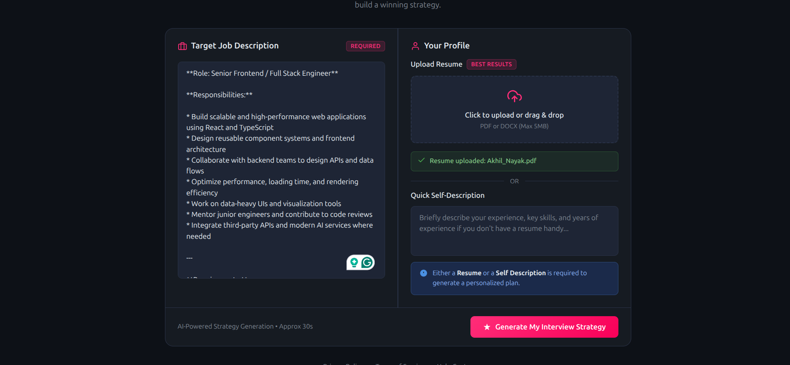
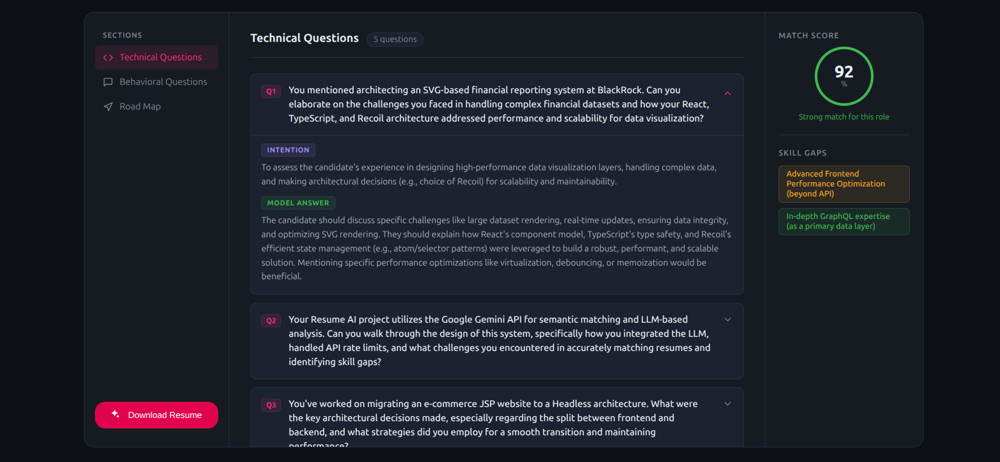
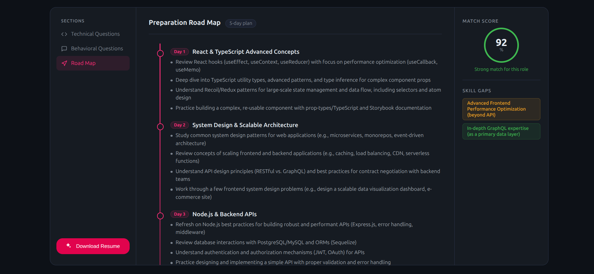

# Resume AI - Interview Preparation & Resume Analysis Tool

A full-stack web application that helps users prepare for interviews by analyzing their resumes against job descriptions and generating detailed interview reports with AI-powered insights.

## 🚀 Features

- **User Authentication**: Secure login and registration system
- **Resume Upload**: Upload PDF resumes for analysis
- **Job Description Analysis**: Compare resume against specific job requirements
- **AI-Powered Interview Reports**: Generate detailed interview preparation reports
- **Resume PDF Generation**: Create optimized resumes based on interview analysis
- **Report History**: View and manage all previous interview reports

## 📸 Screenshots

### Login Page


### Registration Page


### Home Dashboard


### Interview Analysis


### Report Generation


### Resume Upload


### Interview Report


## 🛠️ Tech Stack

### Frontend
- **React 19** - Modern React with hooks
- **TypeScript** - Type-safe JavaScript
- **React Router** - Client-side routing
- **Vite** - Fast build tool and dev server
- **Axios** - HTTP client for API calls
- **SCSS** - Styling with Sass

### Backend
- **Node.js** - JavaScript runtime
- **Express.js** - Web framework
- **MongoDB** - NoSQL database with Mongoose ODM
- **JWT** - Authentication tokens
- **Google Generative AI** - AI-powered analysis
- **Puppeteer** - PDF generation
- **Multer** - File upload handling
- **bcryptjs** - Password hashing

## 📋 Prerequisites

- Node.js (v16 or higher)
- npm or yarn
- MongoDB (local or cloud instance)
- Google AI API key

## 🚀 Installation & Setup

### 1. Clone the Repository
```bash
git clone <repository-url>
cd resume-ai
```

### 2. Backend Setup

Navigate to the backend directory:
```bash
cd Backend
```

Install dependencies:
```bash
npm install
```

Create a `.env` file with the following variables:
```env
PORT=5000
MONGODB_URI=mongodb://localhost:27017/resume-ai
JWT_SECRET=your-super-secret-jwt-key
GOOGLE_AI_API_KEY=your-google-ai-api-key
```

Start the backend server:
```bash
npm run dev
```

The backend will run on `http://localhost:5000`

### 3. Frontend Setup

Navigate to the frontend directory:
```bash
cd ../Frontend
```

Install dependencies:
```bash
npm install
```

Start the frontend development server:
```bash
npm run dev
```

The frontend will run on `http://localhost:5173`

## 📡 API Documentation

### Authentication Endpoints

#### Register User
- **POST** `/api/auth/register`
- **Description**: Register a new user account
- **Body**: 
  ```json
  {
    "username": "string",
    "email": "string",
    "password": "string"
  }
  ```
- **Response**: JWT token and user data

#### Login User
- **POST** `/api/auth/login`
- **Description**: Authenticate user and return JWT token
- **Body**:
  ```json
  {
    "email": "string",
    "password": "string"
  }
  ```
- **Response**: JWT token and user data

#### Logout User
- **GET** `/api/auth/logout`
- **Description**: Logout user and invalidate token
- **Headers**: `Authorization: Bearer <token>`

#### Get Current User
- **GET** `/api/auth/get-me`
- **Description**: Get current authenticated user details
- **Headers**: `Authorization: Bearer <token>`
- **Response**: User data

### Interview Endpoints

#### Generate Interview Report
- **POST** `/api/interview/`
- **Description**: Generate interview report based on resume and job description
- **Headers**: `Authorization: Bearer <token>`
- **Body**: `FormData` with:
  - `resume`: PDF file
  - `jobDescription`: Text string
- **Response**: Generated interview report

#### Get All Interview Reports
- **GET** `/api/interview/`
- **Description**: Get all interview reports for the authenticated user
- **Headers**: `Authorization: Bearer <token>`
- **Response**: Array of interview reports

#### Get Interview Report by ID
- **GET** `/api/interview/report/:id`
- **Description**: Get specific interview report by ID
- **Headers**: `Authorization: Bearer <token>`
- **Response**: Single interview report

#### Generate Resume PDF
- **POST** `/api/interview/resume/pdf/:interviewReportId`
- **Description**: Generate optimized resume PDF based on interview report
- **Headers**: `Authorization: Bearer <token>`
- **Response**: PDF file download

## 🔧 Environment Variables

### Backend (.env)
```env
# Server Configuration
PORT=5000

# Database
MONGODB_URI=mongodb://localhost:27017/resume-ai

# Authentication
JWT_SECRET=your-super-secret-jwt-key

# Google AI
GOOGLE_AI_API_KEY=your-google-ai-api-key
```

## 🏗️ Project Structure

```
resume-ai/
├── Backend/
│   ├── src/
│   │   ├── config/          # Database configuration
│   │   ├── controllers/     # Route controllers
│   │   ├── middlewares/      # Custom middlewares
│   │   ├── models/          # MongoDB models
│   │   ├── routes/          # API routes
│   │   ├── services/        # Business logic
│   │   └── app.js           # Express app setup
│   ├── package.json
│   └── server.js            # Server entry point
├── Frontend/
│   ├── src/
│   │   ├── features/
│   │   │   ├── auth/        # Authentication components
│   │   │   └── interview/   # Interview components
│   │   ├── style/           # Global styles
│   │   ├── App.tsx          # Main app component
│   │   ├── app.routes.tsx   # Route configuration
│   │   └── main.tsx         # App entry point
│   ├── package.json
│   └── vite.config.js
├── screenshots/             # Application screenshots
└── README.md
```

## 🎯 Usage

1. **Create Account**: Register a new user account
2. **Login**: Authenticate with your credentials
3. **Upload Resume**: Navigate to the home page and upload your PDF resume
4. **Add Job Description**: Paste the job description for the role you're applying for
5. **Generate Report**: Click analyze to generate an AI-powered interview report
6. **View Results**: Review the detailed analysis and recommendations
7. **Download Optimized Resume**: Generate and download an improved resume based on the analysis

## 🔐 Security Features

- JWT-based authentication
- Password hashing with bcryptjs
- Protected routes with authentication middleware
- File upload validation
- CORS configuration

## 🤝 Contributing

1. Fork the repository
2. Create a feature branch (`git checkout -b feature/AmazingFeature`)
3. Commit your changes (`git commit -m 'Add some AmazingFeature'`)
4. Push to the branch (`git push origin feature/AmazingFeature`)
5. Open a Pull Request

## 📝 License

This project is licensed under the ISC License - see the package.json file for details.

## 🆘 Troubleshooting

### Common Issues

1. **MongoDB Connection Error**: Ensure MongoDB is running and the connection string is correct
2. **JWT Token Error**: Check that JWT_SECRET is set in your .env file
3. **Google AI API Error**: Verify your Google AI API key is valid and has sufficient credits
4. **File Upload Error**: Ensure resume files are in PDF format and under size limits

## 👨‍💻 Author

**Akhil Nayak**

ThankYou.Peace.


